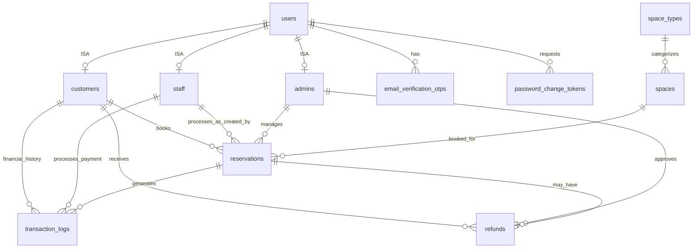

# User Role Generalization Implementation

## Overview
This document describes the implementation of a generalization (inheritance) pattern for user roles in the CO-Z Co-Workspace application. The system now uses separate tables for `customers`, `staff`, and `admins` that all reference the base `users` table.

## Database Schema

### ERD Diagram


### Tables

#### `users` (Base Table)
- `id` - Primary Key
- `name` - User's full name
- `email` - Unique email (authentication)
- `password` - Hashed password
- `phone` - Contact number (nullable)
- `email_verified_at` - Email verification timestamp
- `is_active` - Account status
- `google_id` - OAuth integration (nullable)
- `avatar` - Profile picture URL (nullable)
- `remember_token` - Session management
- `created_at`, `updated_at` - Timestamps

**Note:** The `role` enum column has been removed. Roles are now determined by the existence of records in specialized tables.

#### `customers` (Customer Profile)
- `id` - Primary Key
- `user_id` - Foreign Key → users.id (unique, ISA relationship)
- `company_name` - Optional company affiliation
- `status` - Customer status (pending, active, inactive)
- `total_bookings` - Booking count
- Plus other customer-specific fields

#### `staff` (Staff Profile)
- `id` - Primary Key
- `user_id` - Foreign Key → users.id (unique, ISA relationship)
- `employee_id` - Unique employee identifier
- `department` - Department assignment
- `hourly_rate` - Compensation rate
- `hired_date` - Employment start date

#### `admins` (Admin Profile)
- `id` - Primary Key
- `user_id` - Foreign Key → users.id (unique, ISA relationship)
- `permission_level` - Admin level (super_admin, admin, moderator)
- `permissions` - JSON array of specific permissions

## Model Relationships

### User Model
```php
// ISA relationships (1:1)
$user->customer  // Customer profile or null
$user->staff     // Staff profile or null
$user->admin     // Admin profile or null

// Role checking
$user->isCustomer()  // Returns bool
$user->isStaff()     // Returns bool
$user->isAdmin()     // Returns bool
$user->hasRole('admin')  // Returns bool

// Get all roles
$user->getRoles()  // Returns ['admin', 'customer']

// Get primary role
$user->getPrimaryRole()  // Returns 'admin' (highest priority)

// Get active profile
$user->getActiveProfile()  // Returns Admin|Staff|Customer|null
```

### Customer Model
```php
$customer->user()  // BelongsTo User
$customer->reservations()  // HasMany Reservation
$customer->validateCashBooking()  // Business logic
```

### Staff Model
```php
$staff->user()  // BelongsTo User
$staff->processedReservations()  // HasMany Reservation
$staff->processedTransactions()  // HasMany TransactionLog
$staff->formatted_hourly_rate  // Accessor
```

### Admin Model
```php
$admin->user()  // BelongsTo User
$admin->managedReservations()  // HasMany Reservation
$admin->processedRefunds()  // HasMany Refund
$admin->processedTransactions()  // HasMany TransactionLog
$admin->hasPermission('manage_spaces')  // Returns bool
$admin->isSuperAdmin()  // Returns bool
$admin->grantPermission('approve_refunds')
$admin->revokePermission('delete_users')
```

## Usage Examples

### Creating Users with Multiple Roles

```php
use App\Models\User;
use App\Models\Customer;
use App\Models\Admin;

// Create a user who is both admin and customer
$user = User::create([
    'name' => 'John Admin',
    'email' => 'john@coz.com',
    'password' => bcrypt('password'),
    'phone' => '09123456789',
    'is_active' => true,
    'email_verified_at' => now(),
]);

// Make them an admin
Admin::create([
    'user_id' => $user->id,
    'permission_level' => 'super_admin',
]);

// Also make them a customer (so they can book spaces!)
Customer::create([
    'user_id' => $user->id,
    'name' => $user->name,
    'email' => $user->email,
    'phone' => $user->phone,
    'status' => 'active',
]);

// Now this admin can:
// 1. Access admin dashboard ($user->isAdmin() === true)
// 2. Book spaces as a customer ($user->isCustomer() === true)
// 3. See their reservations in customer view
```

### Checking Permissions

```php
// In controllers or middleware
if ($user->isAdmin()) {
    // Access admin features
}

if ($user->admin && $user->admin->hasPermission('approve_refunds')) {
    // Approve refund
}

// Multi-role check
if ($user->isAdmin() || $user->isStaff()) {
    // Access staff panel
}
```

### Getting User Data

```php
$user = User::find(1);

// Get all roles this user has
$roles = $user->getRoles();  // ['admin', 'customer']

// Get role-specific data
if ($user->isCustomer()) {
    $bookingCount = $user->customer->total_bookings;
    $reservations = $user->customer->reservations;
}

if ($user->isAdmin()) {
    $permissionLevel = $user->admin->permission_level;
    $permissions = $user->admin->permissions;
}

// Get primary role display
echo $user->formatted_role;  // "Admin, Customer"
echo $user->getPrimaryRole();  // "admin"
```

### Querying Users by Role

```php
// Get all admins
$admins = User::whereHas('admin')->get();

// Get all customers
$customers = User::whereHas('customer')->get();

// Get all staff
$staff = User::whereHas('staff')->get();

// Get users with multiple roles
$adminCustomers = User::whereHas('admin')
    ->whereHas('customer')
    ->get();

// Get super admins only
$superAdmins = User::whereHas('admin', function($query) {
    $query->where('permission_level', 'super_admin');
})->get();
```

## Migration Details

The migration `2025_11_10_164618_remove_role_from_users_table.php` performs the following:

1. **Creates specialized records:**
   - All users with `role='admin'` → creates `admins` record
   - All users with `role='staff'` → creates `staff` record
   - All users with `role='customer'` → ensures `customers` record exists

2. **Removes old role column:**
   - Drops the `role` enum column from `users` table

3. **Rollback support:**
   - The `down()` method restores the `role` column
   - Repopulates role data from specialized tables

## Benefits

### 1. Multi-Role Support
A user can now be an admin AND a customer simultaneously:
```php
// Admin who wants to book a space
$user->isAdmin() && $user->isCustomer()  // Both true!
```

### 2. Separation of Concerns
Each role has its own specialized data:
- **Customer:** company_name, booking history
- **Staff:** employee_id, department, hourly_rate
- **Admin:** permission_level, custom permissions

### 3. Scalability
Easy to add new user types:
```php
// Future: Add Partners, Vendors, etc.
php artisan make:model Partner -m
```

### 4. Clear Relationships
```php
// Who processed this refund?
$refund->processedByAdmin->user->name

// Who made this booking?
$reservation->customer->user->email
```

## Controller Updates

### Example: Handling Bookings

```php
public function store(Request $request)
{
    $user = auth()->user();
    
    // Ensure user has customer profile
    if (!$user->isCustomer()) {
        // Create customer profile on-the-fly
        $customer = Customer::create([
            'user_id' => $user->id,
            'name' => $user->name,
            'email' => $user->email,
            'phone' => $user->phone,
            'status' => 'active',
        ]);
    } else {
        $customer = $user->customer;
    }
    
    // Create reservation
    $reservation = Reservation::create([
        'customer_id' => $customer->id,
        'created_by' => $user->id,  // Who created it (could be admin)
        // ... other fields
    ]);
}
```

### Example: Admin Check

```php
// Before (single role)
if ($user->role === 'admin') { ... }

// After (generalization)
if ($user->isAdmin()) { ... }

// Or with permissions
if ($user->admin && $user->admin->hasPermission('manage_spaces')) { ... }
```

## Testing

```php
// tests/Unit/UserRoleTest.php
public function test_user_can_have_multiple_roles()
{
    $user = User::factory()->create();
    
    // Assign admin role
    Admin::create(['user_id' => $user->id]);
    
    // Assign customer role
    Customer::create(['user_id' => $user->id]);
    
    $this->assertTrue($user->isAdmin());
    $this->assertTrue($user->isCustomer());
    $this->assertFalse($user->isStaff());
    
    $roles = $user->getRoles();
    $this->assertContains('admin', $roles);
    $this->assertContains('customer', $roles);
}

public function test_admin_can_book_space_as_customer()
{
    $user = User::factory()->create();
    Admin::create(['user_id' => $user->id]);
    Customer::create(['user_id' => $user->id]);
    
    $reservation = Reservation::factory()->create([
        'customer_id' => $user->customer->id,
    ]);
    
    $this->assertTrue($user->customer->reservations->contains($reservation));
}
```

## Backward Compatibility

The migration maintains backward compatibility:
- All existing functionality continues to work
- `$user->isAdmin()`, `$user->isCustomer()`, etc. still work
- The only change is the internal implementation

## Future Enhancements

1. **Role-based permissions system:**
```php
$admin->grantPermission('manage_spaces');
$admin->grantPermission('approve_refunds');
$admin->hasPermission('delete_users');  // false
```

2. **Role assignment UI in admin panel**

3. **Audit logging for role changes**

4. **Additional user types:**
   - Partners (external collaborators)
   - Vendors (service providers)
   - Guests (temporary access)

## Summary

The generalization pattern provides:
✅ **Flexibility:** Users can have multiple roles simultaneously
✅ **Clarity:** Each role has specialized data and behavior
✅ **Scalability:** Easy to add new user types
✅ **Real-world accuracy:** Admin can also be a customer
✅ **Better data modeling:** Follows OOP principles (ISA relationship)

This implementation follows the **object-oriented generalization/inheritance** pattern where:
- `User` is the **supertype** (general entity)
- `Customer`, `Staff`, `Admin` are **subtypes** (specialized entities)
- Each subtype **IS-A** User (inherits base properties)
